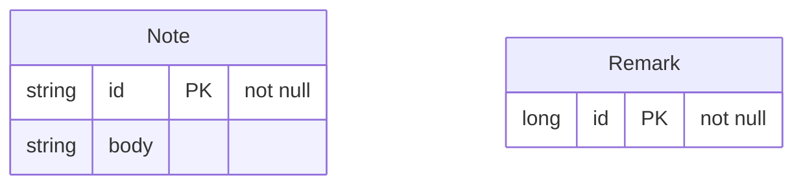

<!-- Generated by `qits database diagram` (jpa). Do not edit: the entity-diagram automation rewrites this file on every release request fold. -->
# Persistence unit `<default>`

Datasource `<default>` · package `eu.wohlben.qits.cli.access.database.fixtures.other` · 2 entities

