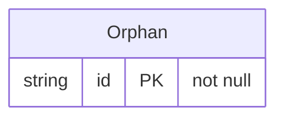

<!-- Generated by `qits database diagram` (jpa). Do not edit: the entity-diagram automation rewrites this file on every release request fold. -->
# Package `eu.wohlben.qits.cli.access.database.fixtures.stray`

No persistence unit of this repository lists it · 1 entity

