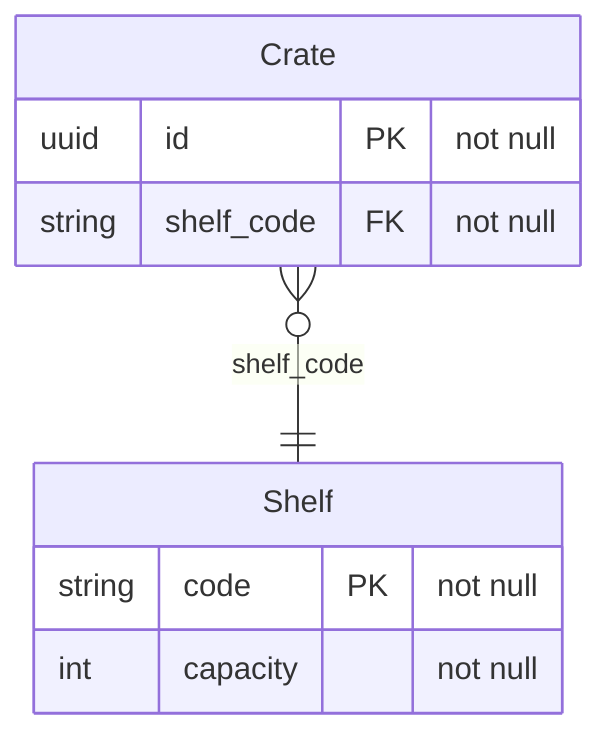

<!-- Generated by `qits database diagram` (jpa). Do not edit: the entity-diagram automation rewrites this file on every release request fold. -->
# Persistence unit `library`

Datasource `<default>` · packages `eu.wohlben.qits.cli.access.database.fixtures.library`, `eu.wohlben.qits.cli.access.database.fixtures.plain` · 2 entities

