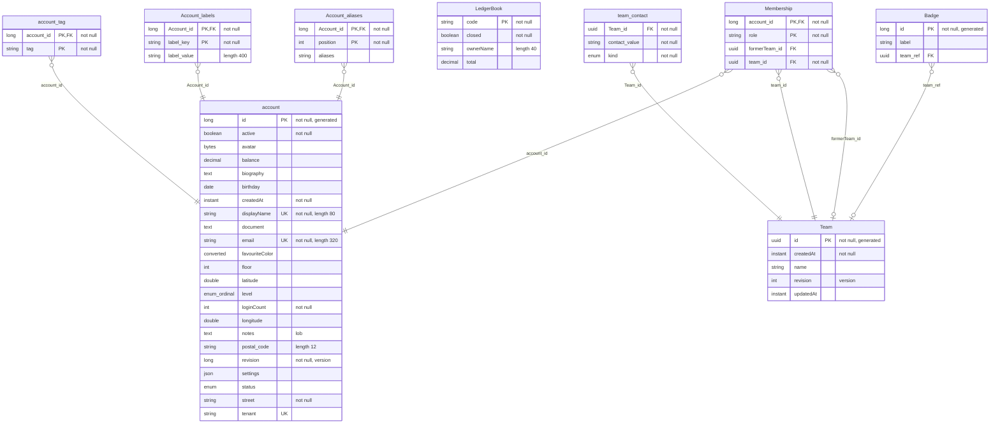

<!-- Generated by `qits database diagram` (jpa). Do not edit: the entity-diagram automation rewrites this file on every release request fold. -->
# Persistence unit `model`

Datasource `main` · package `eu.wohlben.qits.cli.access.database.fixtures.model` · 5 entities

