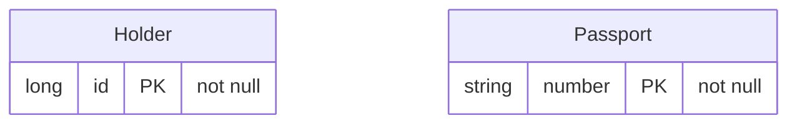

<!-- Generated by `qits database diagram` (jpa). Do not edit: the entity-diagram automation rewrites this file on every release request fold. -->
# Persistence unit `unsupported`

Datasource `<default>` · package `eu.wohlben.qits.cli.access.database.fixtures.unsupported` · 2 entities

- Not drawn: `Passport.holder` (`@OneToOne`)
- Not drawn: `Passport.previousHolders` (`@ManyToMany`)
- Not drawn: `Passport.shouted` (`@Formula`)
